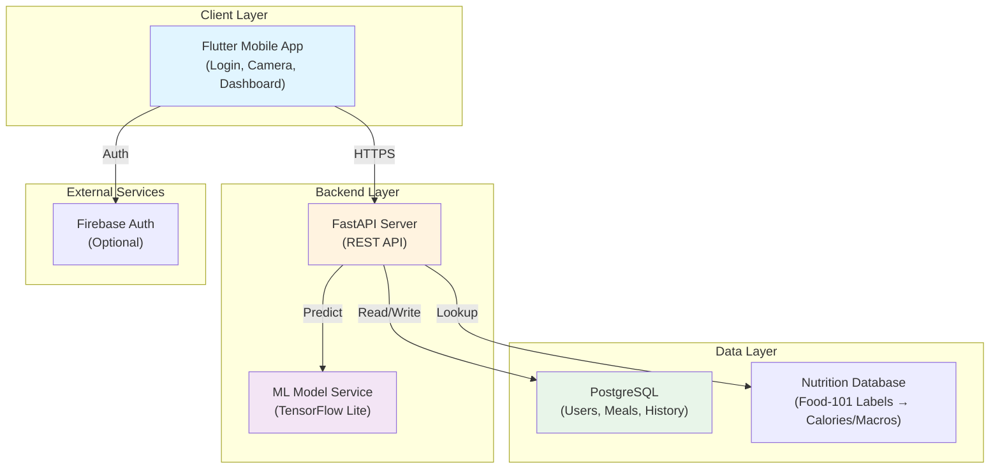

# Image-Based Food Recognition and Nutrition Analysis Application

## Table of Contents
1. [3-Month Roadmap](#3-month-roadmap)
2. [System Architecture](#system-architecture)
3. [AI Model Training](#ai-model-training)
4. [Nutrition Mapping](#nutrition-mapping)
5. [FastAPI Backend](#fastapi-backend) 
6. [Database Schema](#database-schema)
7. [Flutter App](#flutter-app)
8. [Model Evaluation](#model-evaluation)
9. [Folder Structure](#folder-structure)
10. [Deployment](#deployment)

---

## 3-Month Roadmap

### **Month 1: Foundation & Model Training (Weeks 1-4)**

**Week 1-2: Setup & Data Preparation**
- ✅ Set up Google Colab notebook + Kaggle Food-101 dataset
- ✅ EDA (Exploratory Data Analysis) on Food-101
- ✅ Data preprocessing & augmentation pipeline
- ✅ **Deliverable:** Working dataset loader in Colab

**Week 3-4: Model Training**
- ✅ Fine-tune MobileNetV2 on Food-101
- ✅ Evaluate on validation set
- ✅ Save trained model (.h5 or .pb)
- ✅ **Deliverable:** Model with 70%+ top-1 accuracy

**What to focus on:** A working model. Don't optimize to 85% accuracy yet—get 70% working first, then iterate.

---

### **Month 2: Backend & Integration (Weeks 5-8)**

**Week 5: Database & API Skeleton**
- ✅ Design PostgreSQL/SQLite schema
- ✅ Create FastAPI app skeleton (login, image upload endpoints)
- ✅ Set up user authentication (JWT tokens)
- ✅ **Deliverable:** API runs locally, accepts image upload

**Week 6: Model Integration**
- ✅ Convert model to TensorFlow Lite (for mobile)
- ✅ Implement prediction endpoint (image → food prediction)
- ✅ Create nutrition database
- ✅ **Deliverable:** `/predict` endpoint returns food label + calories

**Week 7: Feature Completeness**
- ✅ Implement meal history (save, retrieve, daily summary)
- ✅ Implement nutrition aggregation (daily calories/macros)
- ✅ Error handling & validation
- ✅ **Deliverable:** Full API working locally

**Week 8: Testing & Optimization**
- ✅ Load test API with Locust/Artillery
- ✅ Optimize model latency
- ✅ **Deliverable:** API returns prediction in <2 seconds

**What to focus on:** Don't over-engineer. Hardcode nutrition data if needed. Get the flow working: upload → predict → save → retrieve.

---

### **Month 3: Frontend & Deployment (Weeks 9-12)**

**Week 9-10: Flutter App**
- ✅ Create login screen (Firebase Auth or simple JWT)
- ✅ Camera capture screen
- ✅ Prediction result display
- ✅ **Deliverable:** App connects to local API successfully

**Week 11: Dashboard & Polish**
- ✅ Daily nutrition dashboard
- ✅ Meal history screen
- ✅ Fix bugs from integration testing
- ✅ **Deliverable:** All screens working

**Week 12: Deployment & Demo**
- ✅ Deploy backend to Heroku/Railway/Render
- ✅ Update app to use live API
- ✅ Final testing
- ✅ **Deliverable:** Live demo ready

**What to focus on:** Flutter takes longer than you think. Start in Week 9, not Week 11.

---

## System Architecture



**Key Design Decisions:**
- **TensorFlow Lite Model:** Runs locally on phone (privacy, offline support, fast)
- **REST API:** Simple, stateless, easy to scale
- **PostgreSQL:** For production; SQLite for dev
- **Nutrition Mapping:** Static lookup table (Food-101 label → nutrition facts)

---

## AI Model Training

See [AI_MODEL_GUIDE.md](./docs/AI_MODEL_GUIDE.md) for complete training code, preprocessing, and evaluation.

**Quick Summary:**
- **Dataset:** Food-101 (101 classes, ~750 images per class)
- **Model:** MobileNetV2 (lightweight, ~3.5MB, suitable for mobile)
- **Target Accuracy:** 70%+ on validation
- **Training Time:** ~2-3 hours on Colab GPU
- **Output:** `.h5` model + `.tflite` for mobile

---

## Nutrition Mapping

See [NUTRITION_MAPPING.md](./docs/NUTRITION_MAPPING.md) for implementation details.

**Quick Summary:**
- Create a lookup table: `Food-101 Class → Nutrition Facts`
- Source: Pre-labeled nutrition dataset or APIs (FatSecret, Nutritionix)
- Store in database or JSON file
- Endpoint: `/nutrition/{food_class}` returns calories, protein, carbs, fats

---

## FastAPI Backend

See [BACKEND_GUIDE.md](./docs/BACKEND_GUIDE.md) for complete code.

**Key Endpoints:**
```
POST   /auth/register        # Create user account
POST   /auth/login           # Login, return JWT
POST   /predict              # Upload image, get prediction
POST   /meals                # Save meal prediction
GET    /meals/history        # Retrieve meal history
GET    /meals/daily-summary  # Get today's nutrition
GET    /nutrition/{food_id}  # Get nutrition facts
```

---

## Database Schema

See [DATABASE.md](./docs/DATABASE.md) for full schema.

**Key Tables:**
- `users` — username, email, password_hash, created_at
- `meals` — user_id, food_class, prediction_confidence, calories, timestamp
- `nutrition_facts` — food_class, calories, protein, carbs, fats, fiber
- `meal_history` — aggregated daily summaries

---

## Flutter App

See [FLUTTER_GUIDE.md](./docs/FLUTTER_GUIDE.md) for structure and code samples.

**Screens:**
1. **Login/Register** — Email + password
2. **Camera Capture** — Take photo of food
3. **Prediction Result** — Show food label, confidence, nutrition facts
4. **Daily Dashboard** — Total calories, macros, meal history
5. **Settings** — Profile, logout

**Technology Stack:**
- Dart + Flutter 3.0+
- Provider or Riverpod for state management
- Dio for HTTP requests
- Firebase Auth (optional) or JWT

---

## Model Evaluation

See [EVALUATION.md](./docs/EVALUATION.md) for metrics and analysis.

**Metrics to Track:**
- **Top-1 Accuracy:** % of correct predictions (goal: >70%)
- **Top-5 Accuracy:** Correct label in top 5 predictions (goal: >90%)
- **F1 Score per Class:** Weighted average
- **Confusion Matrix:** Identify which foods your model confuses
- **Latency:** Time to predict on mobile (<500ms)

---

## Folder Structure

```
graduation-project/
├── README.md                          # This file
├── docs/
│   ├── AI_MODEL_GUIDE.md
│   ├── BACKEND_GUIDE.md
│   ├── DATABASE.md
│   ├── NUTRITION_MAPPING.md
│   ├── FLUTTER_GUIDE.md
│   ├── EVALUATION.md
│   └── DEPLOYMENT.md
├── backend/
├── app/
│   ├── main.py
│   ├── model_loader.py
│   ├── schemas.py
│   └── utils.py
├── models/
│   ├── BestModel.keras
│   └── class_names_101.json
├── requirements.txt
├── README.md
└── .gitignore                     # For containerization
├── ml_training/
│   ├── 01_eda.ipynb                   # Exploratory Data Analysis
│   ├── 02_preprocessing.ipynb
│   ├── 03_training.ipynb              # Main training notebook
│   ├── 04_evaluation.ipynb
│   ├── models/                        # Saved models
│   │   ├── mobilenetv2_food101.h5
│   │   └── mobilenetv2_food101.tflite
│   └── data/                          # Food-101 dataset
├── flutter_app/
│   ├── lib/
│   │   ├── main.dart
│   │   ├── screens/
│   │   │   ├── login_screen.dart
│   │   │   ├── camera_screen.dart
│   │   │   ├── prediction_screen.dart
│   │   │   └── dashboard_screen.dart
│   │   ├── models/
│   │   ├── services/
│   │   │   └── api_service.dart       # HTTP client to backend
│   │   └── widgets/
│   ├── pubspec.yaml
│   └── android/, ios/
└── tests/
    ├── test_api.py                    # Backend unit tests
    ├── test_model.py                  # Model tests
    └── integration_test.py
```

---

## Deployment

See [DEPLOYMENT.md](./docs/DEPLOYMENT.md) for detailed instructions.

**Quick Options:**
1. **Backend:** Heroku (free tier ending), Railway, or Render
2. **Database:** Heroku Postgres, Railway, or Neon (free)
3. **Model:** Bundle with backend (simple) or use TensorFlow Serving
4. **Frontend:** Build APK, distribute via GitHub releases or Firebase App Distribution


## Getting Started

### Step 1: Read & Understand
1. Read this README
2. Read [AI_MODEL_GUIDE.md](./docs/AI_MODEL_GUIDE.md) — understand training pipeline

### Step 2: Start Training Model (Weeks 1-4)
1. Open Google Colab
2. Follow ML training notebooks in `ml_training/`
3. Save trained model

### Step 3: Build Backend (Weeks 5-7)
1. Set up PostgreSQL locally
2. Create FastAPI app following [BACKEND_GUIDE.md](./docs/BACKEND_GUIDE.md)
3. Integrate model
4. Test all endpoints

### Step 4: Build Frontend (Weeks 9-10)
1. Create Flutter project
2. Follow [FLUTTER_GUIDE.md](./docs/FLUTTER_GUIDE.md)
3. Connect to live API

### Step 5: Deploy (Week 12)
1. Follow [DEPLOYMENT.md](./docs/DEPLOYMENT.md)
2. Test live

---

## Common Pitfalls (Lessons from Other Graduation Students)

❌ **Mistake 1:** Spending 2 weeks on UI before model is ready
✅ **Solution:** Model first, basic UI can wait

❌ **Mistake 2:** Trying to achieve 90% accuracy on Food-101 (not realistic)
✅ **Solution:** 70% is good for a graduation project; document limitations

❌ **Mistake 3:** Building everything in Python (backend + model)
✅ **Solution:** Deploy model as TFLite on phone, keep backend simple

❌ **Mistake 4:** Using massive model (ResNet-152) on phone
✅ **Solution:** Use MobileNetV2/EfficientNet-Lite for <5MB size

❌ **Mistake 5:** Hardcoding food labels and nutrition
✅ **Solution:** Use a database, make it scalable to 200+ foods easily

---

## Resources & References

- **Dataset:** https://www.vision.ee.ethz.ch/datasets/food-101/ (Download via Kaggle)
- **TensorFlow:** https://www.tensorflow.org/guide
- **FastAPI:** https://fastapi.tiangolo.com/
- **Flutter:** https://flutter.dev/docs
- **Deployment:** https://render.com/, https://railway.app/

---

## Next Steps

→ **Go to [docs/AI_MODEL_GUIDE.md](./docs/AI_MODEL_GUIDE.md) to start training your model**

**Questions?** Check the specific guide files in `docs/` — they have detailed code and examples.

Good luck! 🚀
